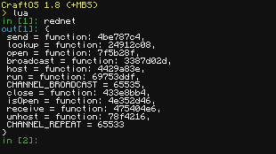
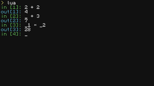
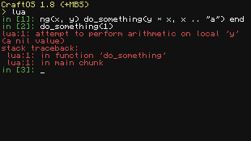
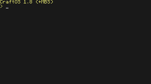
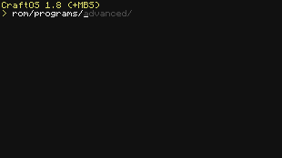
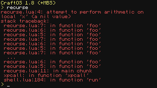

# Mildly better shell

MBS is a series of utilities for improving the default CraftOS experience.

## Features

### Lua REPL extensions
#### Improved serialisation

#### Reuse previous expressions

#### Stack traces

### `read` improvements
#### readline keybindings

### Shell extensions
#### Better program resolution and completion

#### Improved support for fullscreen programs

#### Even works when a program errors!

#### Scrollback to view output of long commands

#### Stack traces

## Install
 - `wget https://raw.githubusercontent.com/SquidDev-CC/mbs/master/mbs.lua mbs.lua`
 - `mbs.lua install`
 - Restart your computer